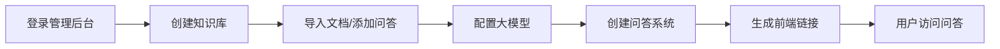

<div align="center">

# 🌟 KnowQ 智答星

**AI知识库问答平台**

一款功能强大的企业级AI知识库问答系统，支持多知识库管理、多LLM接入、智能问答生成

[](LICENSE)
[](https://www.python.org/)
[](https://reactjs.org/)
[](https://fastapi.tiangolo.com/)

[在线演示](#) · [快速开始](#-快速开始) · [功能特性](#-功能特性) · [技术架构](#-技术架构)

</div>

---

## 📖 项目简介

KnowQ智答星是一款AI知识库问答平台，支持创建多个知识库，配置大模型与搜索策略，并一键生成面向最终用户的AI问答前端。系统支持**AI模式**和**规则模式**两种运行方式，适用于企业内部知识管理、智能客服、产品问答等多种场景。

---

## ✨ 功能特性

### 🗃️ 知识库管理
- 📁 支持创建多个独立知识库
- 📄 支持多种文档格式导入（TXT、PDF、Word、Markdown）
- ✏️ 手动添加问答对
- 🔍 智能文档分块与解析

### 🤖 大模型配置
- 🔌 内置支持 **13+** 主流LLM提供商
  - OpenAI、Anthropic、Google、xAI
  - DeepSeek、Kimi、智谱AI、Minimax
  - 阿里云、硅基流动、无问芯穹、模力方舟
- ⚙️ 可配置温度、最大Token等参数
- 🔗 支持自定义LLM接入

### 🎯 问答系统
- 🧠 **AI模式**：大模型智能问答，支持联网搜索
- 📋 **规则模式**：BM25/TF-IDF关键词匹配
- 🌐 集成 Tavily Search 联网搜索
- 💬 一键生成独立问答前端

### 👥 用户与权限
- 🔐 JWT Token 身份认证
- 👨‍💼 管理员/普通用户角色
- 📊 操作日志审计

### 📈 数据统计
- 📉 可视化数据看板
- 📊 提问次数、命中率统计
- 🕐 时间维度筛选

---

## 🛠️ 技术架构

<table>
<tr>
<td align="center"><b>前端</b></td>
<td align="center"><b>后端</b></td>
<td align="center"><b>数据库</b></td>
<td align="center"><b>AI/ML</b></td>
</tr>
<tr>
<td>


</td>
<td>


</td>
<td>


</td>
<td>


</td>
</tr>
</table>

---

## 📦 项目结构

```
KnowQ/
├── 📂 backend/                 # 后端服务
│   ├── 📄 main.py              # FastAPI 应用入口
│   ├── 📄 database.py          # 数据库配置
│   ├── 📄 models.py            # SQLAlchemy 模型
│   ├── 📄 schemas.py           # Pydantic 模式
│   ├── 📄 auth.py              # 认证模块
│   ├── 📂 routers/             # API 路由
│   │   ├── 📄 auth.py          # 认证接口
│   │   ├── 📄 users.py         # 用户管理
│   │   ├── 📄 knowledge.py     # 知识库管理
│   │   ├── 📄 qa.py            # 问答系统
│   │   ├── 📄 llm_config.py    # LLM配置
│   │   └── 📄 ...              # 其他路由
│   ├── 📂 services/            # 业务服务
│   │   ├── 📄 llm_gateway.py   # LLM网关
│   │   ├── 📄 qa_engine.py     # 问答引擎
│   │   ├── 📄 search.py        # 联网搜索
│   │   └── 📄 document_parser.py # 文档解析
│   └── 📄 requirements.txt     # Python依赖
│
├── 📂 frontend/                # 前端应用
│   ├── 📂 src/
│   │   ├── 📂 pages/           # 页面组件
│   │   │   ├── 📄 Dashboard.tsx    # 数据看板
│   │   │   ├── 📄 KnowledgeBases.tsx # 知识库管理
│   │   │   ├── 📄 LLMConfig.tsx    # LLM配置
│   │   │   ├── 📄 QAFrontend.tsx   # 问答前端
│   │   │   └── 📄 ...              # 其他页面
│   │   ├── 📂 services/        # API服务
│   │   ├── 📂 contexts/        # React Context
│   │   └── 📂 styles/          # 样式文件
│   ├── 📄 package.json         # Node依赖
│   └── 📄 vite.config.ts       # Vite配置
│
└── 📄 README.md                # 项目文档
```

---

## 🚀 快速开始

### 环境要求

-  
- 

### 1️⃣ 克隆项目

```bash
git clone https://github.com/Fanve2025/KnowQ.git
cd KnowQ
```

### 2️⃣ 启动后端

```bash
# 进入后端目录
cd backend

# 创建虚拟环境（推荐）
python -m venv venv
source venv/bin/activate  # Linux/Mac
# venv\Scripts\activate   # Windows

# 安装依赖
pip install -r requirements.txt

# 启动服务
python main.py
```

后端服务将运行在 `http://localhost:6428`

### 3️⃣ 启动前端

```bash
# 进入前端目录
cd frontend

# 安装依赖
npm install

# 启动开发服务器
npm run dev
```

前端服务将运行在 `http://localhost:2428`

### 4️⃣ 访问系统

- 🖥️ **管理后台**：http://localhost:2428
- 🔑 **默认账号**：admin / admin123

---

## ⚙️ 配置说明

### 环境变量

后端支持以下环境变量配置：

| 变量名 | 说明 | 默认值 |
|--------|------|--------|
| `CORS_ORIGINS` | 允许的跨域来源 | `http://localhost:2428` |

### LLM 配置

在管理后台的「大模型配置」页面，选择LLM提供商并填写API Key：

| 提供商 | API Key 获取地址 |
|--------|------------------|
| OpenAI | https://platform.openai.com/api-keys |
| Anthropic | https://console.anthropic.com/ |
| DeepSeek | https://platform.deepseek.com/ |
| 智谱AI | https://open.bigmodel.cn/ |
| Kimi | https://platform.moonshot.cn/ |

### 联网搜索配置

在「联网搜索配置」页面配置 Tavily Search API：
- 获取地址：https://tavily.com/

---

## 📚 API 文档

启动后端服务后，访问以下地址查看 API 文档：

- 📖 **Swagger UI**：http://localhost:6428/docs
- 📕 **ReDoc**：http://localhost:6428/redoc

### 主要 API 端点

| 方法 | 端点 | 说明 |
|------|------|------|
| `POST` | `/api/auth/login` | 用户登录 |
| `GET` | `/api/users` | 获取用户列表 |
| `GET` | `/api/knowledge` | 获取知识库列表 |
| `POST` | `/api/knowledge/{id}/entries` | 添加知识条目 |
| `GET` | `/api/qa/systems` | 获取问答系统列表 |
| `POST` | `/api/qa/ask` | 提交问题 |

---

## 🎯 使用流程



---

## 📸 系统截图

<details>
<summary>点击展开查看截图</summary>

### 管理后台 - 数据看板


### 知识库管理


### 大模型配置


### 问答前端


</details>

---

## 🤝 贡献指南

欢迎提交 Issue 和 Pull Request！

1. 🍴 Fork 本仓库
2. 🌿 创建特性分支 (`git checkout -b feature/AmazingFeature`)
3. 💾 提交更改 (`git commit -m 'Add some AmazingFeature'`)
4. 📤 推送到分支 (`git push origin feature/AmazingFeature`)
5. 🔀 提交 Pull Request

---

## 📄 许可证

本项目基于 [MIT](LICENSE) 许可证开源。

---

## 📮 联系方式

如有问题或建议，欢迎提交 [Issue](https://github.com/Fanve2025/KnowQ/issues)。

---

<div align="center">

**⭐ 如果这个项目对你有帮助，请给一个 Star！⭐**

Made with ❤️ by KnowQ Team

</div>
